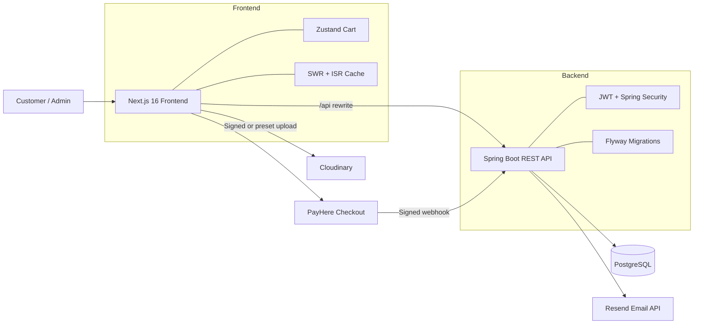

<div align="center">
  

  # VetWorld

  **A full-stack e-commerce platform for veterinary, laboratory, and scientific equipment.**

  [](https://nextjs.org/)
  [](https://react.dev/)
  [](https://spring.io/projects/spring-boot)
  [](https://openjdk.org/)
  [](https://www.postgresql.org/)
</div>

## Overview

VetWorld combines a responsive customer storefront with a role-protected administration dashboard. Customers can discover products, manage a persistent cart, create an account with email verification, pay online through PayHere or submit a bank-transfer receipt, track orders, and download PDF receipts. Administrators can manage the catalogue, banners, users, payments, refunds, and the complete order lifecycle.

The repository contains two independently deployable applications:

- `frontend` — Next.js App Router application and backend-for-frontend routes.
- `backend/VetWorld` — Spring Boot REST API backed by PostgreSQL.

## Features

### Customer storefront

- Responsive desktop and mobile shopping experience.
- Home-page banners, top-selling products, recent products, and category sections.
- Product search with fuzzy matching and type-ahead suggestions.
- Category browsing, filters, pagination, product variants, and sold-out indicators.
- Persistent shopping cart powered by Zustand.
- Multi-step checkout with Sri Lankan address and district selection.
- PayHere card payments with signed webhook verification.
- Bank-transfer receipt upload and manual payment-review workflow.
- Personal order history, live status updates, cancellation/refund information, and downloadable PDF receipts.
- WhatsApp contact shortcut and customer contact section.

### Authentication and security

- Email-based signup with a six-digit, single-use OTP.
- Login, logout, profile editing, forgot-password, and reset-password flows.
- Stateless JWT authentication stored in an `HttpOnly`, `SameSite=Strict` cookie.
- BCrypt password hashing and role-based Spring Security authorization.
- Separate `USER` and `ADMIN` permissions.
- Rate limiting on authentication endpoints.
- Ownership checks for customer orders and receipts.
- Server-side Cloudinary upload signatures, file-type validation, and a 5 MB upload limit.
- PayHere webhook signature validation before payment state changes.

### Administration

- Dashboard statistics for products, categories, banners, users, and orders.
- Create, update, and delete categories, products, product variants, and banners.
- Mark products or individual variants as sold out.
- Promote products as top-selling items.
- View users, update roles, and remove accounts.
- Review orders and move them through fulfilment statuses.
- Approve or reject payment slips.
- Cancel orders, collect refund details, and upload refund receipts.
- Generate and download server-side PDF receipts.

## Architecture



## Technology stack

| Layer | Technology |
| --- | --- |
| Frontend | Next.js 16, React 19, TypeScript |
| Styling and motion | Tailwind CSS 4, global CSS, Framer Motion |
| Client state and data | Zustand, SWR, Fuse.js |
| Backend | Java 21, Spring Boot 3.5, Spring Web, Spring Data JPA |
| Security | Spring Security, JWT, BCrypt, Bucket4j |
| Database | PostgreSQL, Hibernate, Flyway |
| Payments | PayHere |
| Media storage | Cloudinary |
| Email | Resend REST API |
| PDF generation | iText 8 |
| Testing | JUnit 5, Spring Boot Test, Testcontainers |
| Packaging | Maven Wrapper, npm, multi-stage Dockerfiles |

## Project structure

```text
vetworld/
├── frontend/
│   ├── app/
│   │   ├── (store)/        # Storefront routes
│   │   ├── admin/          # Protected admin dashboard
│   │   └── api/            # Auth cookie, upload, and cache routes
│   ├── components/         # Storefront and admin UI components
│   ├── lib/                # API client, hooks, uploads, money helpers
│   ├── store/              # Persistent Zustand cart
│   ├── types/              # Shared frontend types
│   └── public/             # Static assets
├── backend/VetWorld/
│   ├── src/main/java/com/vetworld/VetWorld/
│   │   ├── config/         # Security, CORS, seeding, migrations
│   │   ├── controller/     # REST controllers
│   │   ├── dto/            # API request and response types
│   │   ├── model/          # JPA entities and enums
│   │   ├── repository/     # Spring Data repositories
│   │   ├── security/       # JWT filter and user-details service
│   │   ├── service/        # Domain and integration services
│   │   └── util/           # PayHere signature utilities
│   ├── src/main/resources/db/migration/ # Flyway SQL migrations
│   └── src/test/           # Unit and integration tests
└── README.md
```

## Getting started

### Prerequisites

- [Node.js 20+](https://nodejs.org/)
- [Java 21](https://adoptium.net/)
- PostgreSQL 14+ or a hosted PostgreSQL database
- Git
- Optional integrations for the complete application flow:
  - A [Cloudinary](https://cloudinary.com/) account
  - A [Resend](https://resend.com/) account and verified sender
  - A [PayHere](https://www.payhere.lk/) merchant account

Maven does not need to be installed globally because the backend includes the Maven Wrapper.

### 1. Clone the repository

```bash
git clone https://github.com/thuvarahan-t/vetworld.git
cd vetworld
```

### 2. Create the PostgreSQL database

Create an empty database and a database user with permission to create and modify tables. Flyway applies the schema automatically when the backend starts.

Example with PostgreSQL CLI:

```sql
CREATE USER vetworld_user WITH ENCRYPTED PASSWORD 'replace-with-a-strong-password';
CREATE DATABASE vetworld OWNER vetworld_user;
```

### 3. Configure the backend

Create `backend/VetWorld/.env`:

```dotenv
# Server and database
PORT=8080
SPRING_DATASOURCE_URL=jdbc:postgresql://localhost:5432/vetworld
SPRING_DATASOURCE_USERNAME=vetworld_user
SPRING_DATASOURCE_PASSWORD=replace-with-a-strong-password

# Use a long, random value; do not commit it
JWT_SECRET=replace-with-a-random-secret-of-at-least-32-bytes

# Initial administrator account
APP_ADMIN_NAME=VetWorld Admin
APP_ADMIN_EMAIL=admin@example.com
APP_ADMIN_PASSWORD=replace-with-a-strong-admin-password

# Frontend origins allowed to call the API
APP_CORS_ALLOWED_ORIGIN_PATTERNS=http://localhost:3000

# Email verification and notifications
RESEND_API_KEY=re_your_api_key
APP_MAIL_FROM=VetWorld <noreply@your-verified-domain.com>

# PayHere
PAYHERE_MERCHANT_ID=your_merchant_id
PAYHERE_MERCHANT_SECRET=your_merchant_secret
PAYHERE_SANDBOX=true
```

Generate a suitable development JWT secret with `openssl rand -base64 48` or an equivalent cryptographically secure generator.

`APP_ADMIN_EMAIL` and `APP_ADMIN_PASSWORD` are required when the backend first seeds the administrator. The password is stored as a BCrypt hash. Flyway owns the database schema, so migrations should be added under `src/main/resources/db/migration` instead of relying on Hibernate to create tables.

Start the backend:

```bash
cd backend/VetWorld
./mvnw spring-boot:run
```

On Windows PowerShell:

```powershell
cd backend/VetWorld
.\mvnw.cmd spring-boot:run
```

The API is available at `http://localhost:8080/api`, and its health endpoint is `http://localhost:8080/api/health`.

### 4. Configure the frontend

Create `frontend/.env.local`:

```dotenv
# Used by Next.js server requests and the /api rewrite
BACKEND_API_URL=http://localhost:8080

# Browser-visible backend URL used by payment callbacks
NEXT_PUBLIC_API_URL=http://localhost:8080
API_TIMEOUT_MS=30000
PUBLIC_REVALIDATE_SECONDS=300

# Cloudinary: signed uploads are recommended
CLOUDINARY_CLOUD_NAME=your_cloud_name
CLOUDINARY_API_KEY=your_api_key
CLOUDINARY_API_SECRET=your_api_secret
CLOUDINARY_UPLOAD_FOLDER=vetworld/uploads

# Alternatively, configure an unsigned upload preset
# NEXT_PUBLIC_CLOUDINARY_CLOUD_NAME=your_cloud_name
# NEXT_PUBLIC_CLOUDINARY_UPLOAD_PRESET=your_unsigned_preset

# PayHere
NEXT_PUBLIC_PAYHERE_SANDBOX=true
NEXT_PUBLIC_PAYHERE_NOTIFY_URL=https://your-public-api.example.com/api/payments/notify

# Bank-transfer checkout details
NEXT_PUBLIC_BANK_NAME=Your Bank
NEXT_PUBLIC_BANK_ACCOUNT_NAME=Your Account Name
NEXT_PUBLIC_BANK_ACCOUNT_NO=Your Account Number
NEXT_PUBLIC_BANK_BRANCH=Your Branch

# Customer support
NEXT_PUBLIC_WHATSAPP_NUMBER=94770000000
```

PayHere must be able to reach `NEXT_PUBLIC_PAYHERE_NOTIFY_URL` from the internet. For local webhook testing, use a secure tunnel and point this variable to its public HTTPS URL.

Install dependencies and start the frontend:

```bash
cd frontend
npm ci
npm run dev
```

Open `http://localhost:3000`. The admin dashboard is available at `http://localhost:3000/admin` after signing in with the seeded administrator account.

## Environment variable reference

### Backend

| Variable | Required | Purpose |
| --- | :---: | --- |
| `SPRING_DATASOURCE_URL` | Yes | PostgreSQL JDBC connection URL |
| `SPRING_DATASOURCE_USERNAME` | Yes | Database username |
| `SPRING_DATASOURCE_PASSWORD` | Yes | Database password |
| `JWT_SECRET` | Yes | Signs and verifies authentication tokens |
| `APP_ADMIN_EMAIL` | First run | Email for the seeded administrator |
| `APP_ADMIN_PASSWORD` | First run | Password for the seeded administrator |
| `APP_ADMIN_NAME` | No | Administrator display name; defaults to `Admin` |
| `APP_CORS_ALLOWED_ORIGIN_PATTERNS` | Production | Comma-separated allowed frontend origin patterns |
| `RESEND_API_KEY` | Full auth flow | Sends signup OTPs, resets, and order emails |
| `APP_MAIL_FROM` | Email enabled | Verified sender address used by Resend |
| `PAYHERE_MERCHANT_ID` | PayHere enabled | PayHere merchant identifier |
| `PAYHERE_MERCHANT_SECRET` | PayHere enabled | Creates and verifies payment signatures |
| `PAYHERE_SANDBOX` | No | Enables PayHere sandbox mode; defaults to `false` |
| `PORT` | No | Backend port; defaults to `8080` |

### Frontend

| Variable | Required | Purpose |
| --- | :---: | --- |
| `BACKEND_API_URL` | Yes | Server-side API base and Next.js rewrite destination |
| `NEXT_PUBLIC_API_URL` | Payment flow | Public API base used as a payment callback fallback |
| `NEXT_PUBLIC_PAYHERE_NOTIFY_URL` | PayHere enabled | Public PayHere webhook URL |
| `NEXT_PUBLIC_PAYHERE_SANDBOX` | No | Controls the PayHere client sandbox setting |
| `CLOUDINARY_CLOUD_NAME` | Uploads | Cloudinary cloud for signed uploads |
| `CLOUDINARY_API_KEY` | Signed uploads | Server-side Cloudinary API key |
| `CLOUDINARY_API_SECRET` | Signed uploads | Server-only Cloudinary signing secret |
| `CLOUDINARY_UPLOAD_FOLDER` | No | Upload destination; defaults to `vetworld/uploads` |
| `NEXT_PUBLIC_CLOUDINARY_UPLOAD_PRESET` | Unsigned uploads | Alternative unsigned-upload preset |
| `PUBLIC_REVALIDATE_SECONDS` | No | Storefront catalogue cache duration; defaults to `300` |
| `API_TIMEOUT_MS` | No | Backend request timeout; defaults to `30000` |
| `NEXT_PUBLIC_BANK_*` | Bank transfer | Bank details displayed during checkout |
| `NEXT_PUBLIC_WHATSAPP_NUMBER` | No | WhatsApp customer-support number |

Never commit `.env` or `.env.local` files. Variables prefixed with `NEXT_PUBLIC_` are included in the browser bundle and must not contain secrets.

## API overview

| Area | Base path | Access | Capabilities |
| --- | --- | --- | --- |
| Health | `/api/health` | Public | Service health check |
| Authentication | `/api/auth` | Public/authenticated | OTP, signup, login, current user, profile, password reset |
| Products | `/api/products` | Public read | List, search, recent, top-selling, product details |
| Categories | `/api/categories` | Public read | Category list, details, and category products |
| Banners | `/api/banners` | Public read | Active storefront banners |
| Orders | `/api/orders` | Authenticated user | Checkout, order history, payment slips, refund details, receipts |
| Payments | `/api/payments/notify` | Signed webhook | PayHere payment result processing |
| Administration | `/api/admin` | Admin only | Catalogue, banners, users, orders, payments, refunds, statistics |

## Order lifecycle

Orders use the following statuses:

```text
PENDING_PAYMENT → PAYMENT_REVIEW → CONFIRMED → PROCESSING → PACKED → DELIVERED
       │                  │
       ├─ PAYMENT_FAILED  └─ rejected slip returns to PENDING_PAYMENT
       ├─ PAYMENT_CANCELLED
       └─ CANCELLED → REFUNDED
```

- PayHere payments move to `CONFIRMED` only after a valid signed webhook is received.
- Uploaded bank-transfer slips move to `PAYMENT_REVIEW` and require administrator approval.
- Cancellation and refund details remain attached to the order for customer visibility.

## Available commands

### Frontend

```bash
npm run dev       # Start the Next.js development server
npm run build     # Create a production build
npm run start     # Start the production server
npm run lint      # Run ESLint
```

### Backend

```bash
./mvnw spring-boot:run   # Start the API in development
./mvnw test              # Run the test suite
./mvnw clean package     # Build the executable JAR
```

Windows users can replace `./mvnw` with `.\mvnw.cmd`.

## Testing

Backend tests cover authentication controllers, OTP handling, order services, and PayHere webhook verification. Some integration tests use Testcontainers and therefore require a running Docker engine.

Run all checks before opening a pull request:

```bash
cd backend/VetWorld
./mvnw test

cd ../../frontend
npm run lint
npm run build
```

## Deployment notes

- The frontend and backend can be deployed independently; both include multi-stage Dockerfiles.
- Set `BACKEND_API_URL` to the deployed backend URL before building the Next.js application.
- Set `APP_CORS_ALLOWED_ORIGIN_PATTERNS` to the deployed frontend origin.
- Use `PAYHERE_SANDBOX=false` in production and register the production webhook URL with PayHere.
- Use a verified Resend sender domain for production email delivery.
- Keep `JWT_SECRET`, database credentials, PayHere credentials, and `CLOUDINARY_API_SECRET` in the hosting provider's secret manager.
- Apply schema changes through new Flyway migration files. Do not edit migrations that have already run in a shared environment.
- The application exposes `/api/health` for platform health checks.

## Contributing

1. Create a branch from the current development branch.
2. Keep changes focused and include tests for backend behavior where practical.
3. Run the frontend lint/build and backend tests.
4. Open a pull request describing the problem, solution, and verification performed.

## License

No open-source license is currently included in this repository. Unless a license is added, the source code remains under the copyright holder's default rights.
